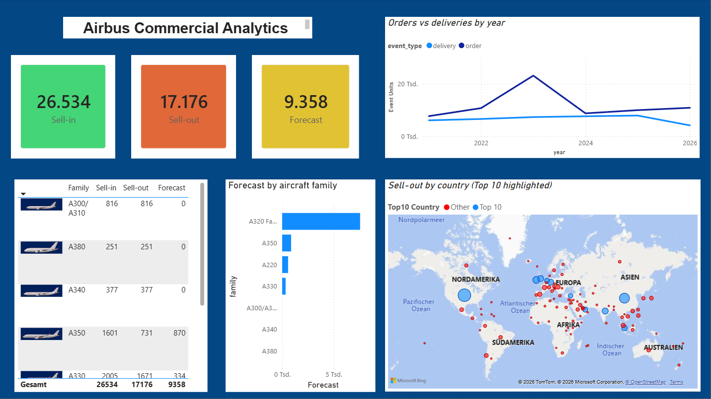

# Airbus Commercial Analytics

Datengrundlage: öffentliche Airbus-Monatsreports **Orders & Deliveries**.
Januar 2021 bis Juli 2026, 67 Excel-Dateien von der [Airbus-Seite](https://www.airbus.com/en/products-services/commercial-aircraft/orders-and-deliveries).

Daraus ein Power-BI-Dashboard. Python bereinigt die Dateien, SQL rechnet die KPIs, Power BI zeigt Sell-in, Sell-out und Forecast nach Flugzeugfamilie und Land.



## Was die Zahlen heißen

Im Dashboard die Sprache vom Business, in den Quelldateien die Airbus-Begriffe:

- **Sell-in 26.534** = Orders, also Auftragseingang über die Laufzeit
- **Sell-out 17.176** = Deliveries, also ausgelieferte Flugzeuge
- **Forecast 9.358** = der Restbestand (Orders minus Deliveries), bei Airbus Backlog genannt

A320 Family hat den größten offenen Bestand. A340, A380 und A300/A310 sind durch (Sell-in = Sell-out).

## Warum nicht alle 67 Dateien in eine Tabelle

Jede Excel-Datei ist ein **YTD-Snapshot** (Jahr bis zum Stichtag), kein einzelner Monat. Alle 67 hintereinanderlegen würde Zahlen doppelt zählen.

Das Script nimmt deshalb **eine Datei pro Jahr**: Dezember, für 2026 den Juli.

## Start

```bash
pip install -r src/requirements.txt
python 01_python_data_cleaning.py
```

Ergebnis liegt in `data/processed/`. Power BI lädt nur diese CSVs, nicht die Original-Excels.
Schritt für Schritt: `dashboards/POWER_BI_SETUP.md`

Die fertigen CSVs sind im Repo. Python muss man nur neu laufen lassen, wenn eine neue Monatsdatei dazukommt.

## Technik

- **Python / pandas:** Dateien finden, Typen vereinheitlichen, wide → long
- **SQL:** Sell-in, Sell-out, Forecast, Top-Kunden, Jahr zu Jahr
- **Power BI:** Sternschema (Fact + Dimensionen), DAX, Karte, Zeitreihe
